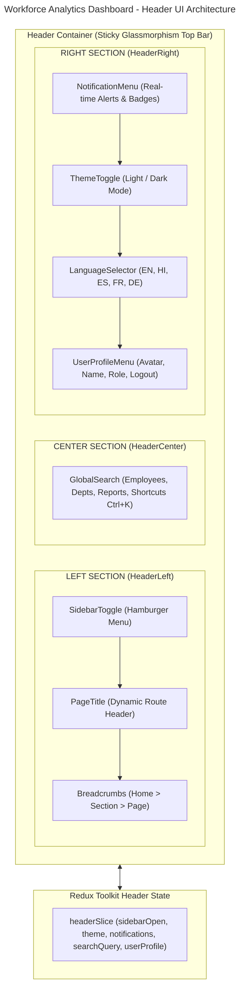
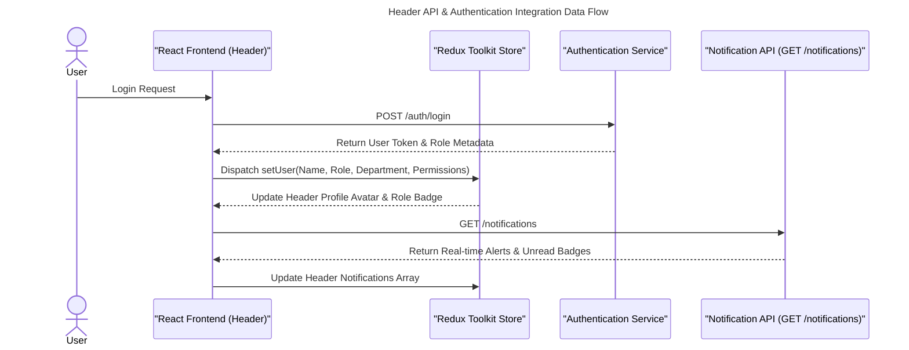

# Workforce Analytics Dashboard - Header Architecture

This document presents the enterprise responsive header navigation architecture, Redux state model, RBAC header behaviors, API integration flows, and component breakdown for the **Workforce Analytics Dashboard**.

---

## 1. Header UI Architecture Diagram



---

## 2. React Component Architecture

```text
src/components/header/
├── Header.tsx               # Master Modular Header Layout Container
├── HeaderLeft.tsx           # Groups Toggle, PageTitle & Breadcrumbs
│   ├── SidebarToggle.tsx    # Mobile & Desktop Sidebar Collapse Button
│   ├── Breadcrumbs.tsx      # Dynamic Route Breadcrumbs (Clickable)
│   └── PageTitle.tsx        # Dynamic Role & Page Title Component
├── HeaderCenter.tsx         # Center Section Wrapper
│   └── GlobalSearch.tsx     # Ctrl + K Search Bar with Filter Pills & Recent Results
├── HeaderRight.tsx          # Groups Right Action Controls
│   ├── NotificationMenu.tsx # Real-time Notification Bell & Unread Badges
│   ├── ThemeToggle.tsx      # Light / Dark Theme Switcher Button
│   ├── LanguageSelector.tsx # Multi-Language Scope Switcher Dropdown
│   └── UserProfileMenu.tsx  # User Avatar, Details, Account Settings & Logout
├── HeaderActions.tsx        # Actions Group Component
├── HeaderResponsive.tsx     # Tablet / Mobile Responsive Controls
├── types.ts                 # TypeScript Interfaces & Header State Data Model
├── headerSlice.ts           # Redux Toolkit Header State Slice
└── index.ts                 # Central Module Barrel Export
```

---

## 3. Redux State Structure (`headerSlice.ts`)

```typescript
export interface HeaderState {
  sidebarOpen: boolean;
  theme: 'light' | 'dark';
  language: LanguageOption;
  notifications: HeaderNotification[];
  unreadNotificationCount: number;
  searchQuery: string;
  searchCategory: 'all' | 'employees' | 'departments' | 'reports' | 'security';
  searchFocused: boolean;
  activeDropdown: 'notif' | 'profile' | 'role' | 'language' | null;
}
```

---

## 4. API Integration Flow



---

## 5. RBAC & Permission-Based Header Behavior

- **ADMIN HEADER**: Displays organization statistics, system audit stream, security alert badges, and system settings access.
- **HR MANAGER HEADER**: Displays HR recruitment alerts, candidate applications, leave request queues, and employee lifecycle updates.
- **DEPARTMENT MANAGER HEADER**: Displays department headcount trends, team leave approvals, and performance evaluation reminders.
- **TEAM LEAD HEADER**: Displays active sprint task counts, team attendance alerts, and productivity metrics.
- **EMPLOYEE HEADER**: Displays personal notifications, leave balance status, and performance goals updates.

---

## 6. Complete Layout Integration

```text
-----------------------------------------------------------------------------
| Logo | Breadcrumbs | Global Search (Ctrl + K) | Notifications | Theme | User |
-----------------------------------------------------------------------------
|          |                                                                |
| Sidebar  |                   Dashboard Content Area                       |
| Navigation|                                                               |
-----------------------------------------------------------------------------
```
